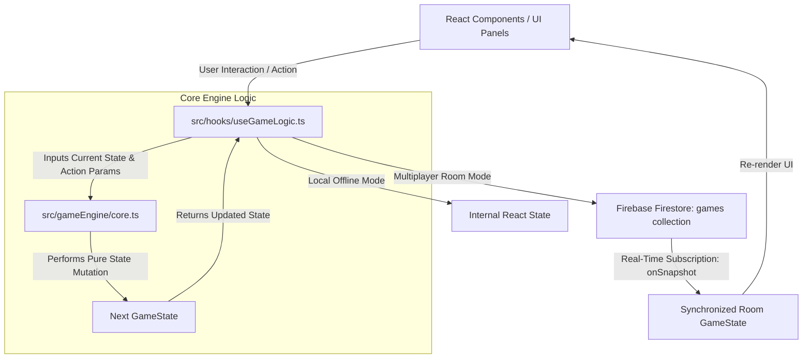

# 🎲 Monopoly Madness Auction - Application Architecture & Developer Manual

> **Current Version: `v1.1.2`**  
> Version is displayed on the lobby start screen (`LobbySystem.tsx` header) and used as the prefix for all git commit summaries.  
> Format: `v<major>.<minor>.<patch>.<build>` — increment build on each fix, patch on each feature set, minor on design overhauls.

Welcome to the **Monopoly Madness Auction** technical architecture documentation. This document serves as a comprehensive system guide, directory map, state flowchart, and developer runbook. 

Whenever you need to introduce new features, tweak existing game mechanics, or debug state transitions, use this document to understand the underlying patterns, constraints, and data flows.

---

## 📌 Architectural Overview

Monopoly Madness Auction is a real-time, multiplayer-first board game built on React, TypeScript, and Tailwind CSS, powered by **Firebase Firestore** for serverless, conflict-free state synchronization. 

The application utilizes a **Unidirectional Data Flow** pattern paired with an **Event-Driven Pure Game Engine**:



### Key Pillars:
1. **Strict Decoupling of Logic and State**: The state is stored either in Firestore (multiplayer) or in a React state hook (local offline play). State transformations are calculated *exclusively* via pure functions defined in the `core.ts` game engine.
2. **Atomic Firestore Transactions**: To prevent race conditions in multiplayer rooms (e.g., two players bidding on the same millisecond or rolling at the same time), all state-mutating actions utilize Firestore `runTransaction`.
3. **Hybrid State Subscription**: The app seamlessly supports local offline gameplay (with bots) and multiplayer rooms. If a `roomId` is present, the hook subscribes to real-time updates via `onSnapshot` and writes updates to the database; otherwise, it degrades gracefully to standard React `useState` updates.

---

## 📂 Codebase Directory & File Mapping

```
monopoly-madness-auction/
├── src/
│   ├── types/
│   │   └── game.ts                # Strict TypeScript models and interface contracts
│   ├── gameEngine/
│   │   └── core.ts                # Pure engine functions (move, purchase, pay rent, bankruptcy)
│   ├── hooks/
│   │   ├── useGameLogic.ts        # Primary state management, Firebase transaction wrappers, deck shufflers
│   │   ├── use-toast.ts           # Toast notification hooks
│   │   └── use-mobile.tsx         # Mobile viewport handler
│   ├── components/
│   │   ├── ui/                    # Reusable shadcn/ui atoms (Dialogs, Buttons, Tabs, Drawers)
│   │   └── game/                  # Game-specific visual and logical components
│   │       ├── MonopolyGame.tsx   # Grand Orchestrator & View Controller
│   │       ├── MonopolyBoardLayout.tsx # SVG/Grid Monopoly Board Layout
│   │       ├── LobbySystem.tsx    # Room creation, joining, and configuration
│   │       ├── TeamPanel.tsx      # Team alliances and shared balances
│   │       ├── TradingSystem.tsx  # Dynamic property and cash trade builder
│   │       ├── AuctionPanel.tsx   # Regular turn bidding module
│   │       ├── PreAuctionPanel.tsx# Draft bidding phase component
│   │       ├── PlayerPanel.tsx    # Portfolio list, house builders, mortgages
│   │       ├── GameConsole.tsx    # Property configuration and customization
│   │       ├── DiceRoller.tsx     # 3D/Visual dice roll triggers
│   │       ├── RentPaymentDialog.tsx # Over-the-board rent collection popups
│   │       ├── GameLog.tsx        # Event feeds and historical logs
│   │       └── TransactionNotification.tsx # Toast overlay of transactions
│   ├── pages/
│   │   ├── Index.tsx              # Mount point for MonopolyGame
│   │   └── NotFound.tsx           # Fallback route
│   ├── lib/
│   │   └── firebase.ts            # Firebase app init & Firestore database instance export
│   ├── App.tsx                    # Routing & global providers
│   ├── main.tsx                   # React DOM render entry
│   └── index.css                  # Global styles, tailwind configs, animations
```

---

## 📊 Domain Data Models (`src/types/game.ts`)

The entire game state is defined by a single unified object contract: `GameState`.

### 1. `Property`
Represents an individual board tile that players can land on, buy, build on, or mortgage:
* `id` (`string`): Unique identifier (e.g., `'prop-1'`).
* `name` (`string`): Indian-themed city name (e.g., `'Mumbai'`, `'Delhi'`).
* `type` (`'property' | 'railroad' | 'utility' | 'special'`): Space category.
* `colorGroup` (`string`): Grouping color (e.g., `'brown'`, `'darkBlue'`).
* `baseValue` & `currentValue` (`number`): Standard market values.
* `rent` (`number[]`): Multi-tier rent array matching house counts `[base, 1 house, 2 houses, 3 houses, 4 houses, hotel]`.
* `houses` (`number`) / `hasHotel` (`boolean`): Building progress.
* `owner` (`string | null`): Name of owning player, if any.
* `position` (`number`): `0-39` position on the board.

### 2. `Player`
An active participant in a lobby:
* `id` (`string`): Player ID (`'player-1'`, `'player-2'`, etc.).
* `name` (`string`): Nickname.
* `balance` (`number`): Current capital.
* `properties` (`string[]`): Owned Property IDs.
* `position` (`number`): Board position index `0-39`.
* `isActive` (`boolean`): Active indicator; set to `false` if bankrupt.
* `isInJail` (`boolean`) & `jailTurns` (`number`): Jailed status.
* `discoveredProperties` (`number[]`): Board tiles this player has landed on or uncovered.

### 3. `Auction`
Represents an active bidding event:
* `propertyId` (`string`): ID of property under auction.
* `startTime` / `duration` / `endTimestamp` (`number`): Dynamic epoch timers.
* `currentBid` (`number`): High bid.
* `highestBidder` (`string | null`): Name of the current leading bidder.
* `bids` (`AuctionBid[]`): Log of bidding increments.
* `isActive` (`boolean`): Status indicator.

### 4. `GameState`
The global state tree synced across all clients in a room:
```typescript
export interface GameState {
  properties: Property[];
  players: Player[];
  teams: Team[];
  currentAuction: Auction | null;
  settings: GameSettings;
  gamePhase: 'setup' | 'draft' | 'auction' | 'playing' | 'ended';
  turn: number;
  currentPlayer: string; // Active Player ID
  lastDiceRoll: DiceRoll | null;
  gameEvents: GameEvent[]; // Rolling history logs (capped to last 20)
  doubleCount: number;
  pendingPurchase: { propertyId: string; playerId: string } | null;
  pendingRent: { propertyId: string; owner: string; amount: number } | null;
  turnState: 'waiting_for_roll' | 'waiting_for_action' | 'processing' | 'completed';
  preAuctionPhase: boolean;
  consoleOpen: boolean;
  tradeOffers: TradeOffer[];
  winnerId?: string | null;
  turnEndTime?: number | null; // Ephemeral epoch countdown
}
```

---

## ⚙️ The Game Engine (`src/gameEngine/core.ts`)

The game engine contains **pure state-transition functions**. They accept a `GameState` and parameters, and return a *new* copy of `GameState` without mutating any parameters in place.

* **`advanceTurn(state)`**:
  Finds the next active, non-spectator player in the circular queue. Updates the `currentPlayer`, resets the `turnState` to `'waiting_for_roll'`, clears ephemeral fields (`pendingPurchase`, `lastDiceRoll`), and appends a `"Turn X - Player Y's Turn"` game event.
  
* **`rollDiceLogic(state, diceResult)`**:
  Processes jail turn reduction if the player is in jail. If they are free, advances the player using `movePlayer`.
  
* **`movePlayer(state, spaces)`**:
  * Updates the current player's board position index (modulo 40).
  * Awards passing GO money if they wrapped around position 0.
  * Adds the tile to their `discoveredProperties` array.
  * Identifies the space type:
    * **Unowned Property/Railroad/Utility**: Sets state to `waiting_for_action` and populates `pendingPurchase`.
    * **Owned Property**: If owned by someone else, calculates the rent using `computeRent` and sets up `pendingRent` with turnState `waiting_for_action`.
    * **Tax Tile**: Immediately applies a 10% cash deduction via `applyPayment` and moves turnState to `completed`.
    * **Jail / Chance / Free Parking**: Triggers appropriate defaults.
    
* **`computeRent(properties, landedProperty, diceTotal)`**:
  * Standard properties: Base rent doubled if the owner holds a monopoly (all properties of that color group) without mortgages. Returns house/hotel tier rent if built.
  * Railroads: Incremental multiplier depending on total owned railroads (`[1: 25k, 2: 50k, 3: 100k, 4: 200k]`).
  * Utilities: Custom dice total scale factor (`4,000 * diceTotal` if 1 owned, `10,000 * diceTotal` if both owned).
  
* **`applyPayment(state, fromId, toPlayerName, amount, reason)`**:
  Adjusts player balances. If the paying player drops below 0:
  * Triggers **Bankruptcy** sequence.
  * Marks the player `isActive = false`.
  * Transfers all assets (properties, hotels) to the creditor (`toPlayerName`). If the creditor is the bank, mortgages are cleared and properties return to the wild.
  * Evaluates `checkWinCondition`.

---

## 🔄 Real-Time Synchronization & Hook Lifecycle (`src/hooks/useGameLogic.ts`)

`useGameLogic` acts as the reactive adapter between the components, the pure engine logic, and the Firestore DB.

```
                  ┌──────────────────────────────┐
                  │      useGameLogic(roomId)    │
                  └──────────────┬───────────────┘
                                 │
                     ┌───────────┴───────────┐
                     ▼                       ▼
            [ ROOM CODE PRESENT ]    [ NO ROOM CODE (LOCAL) ]
                     │                       │
         ┌───────────┴───────────┐           │
         ▼                       ▼           ▼
   Read Snapshot            Transactions    Write directly to
 (onSnapshot listener)    (runTransaction)  useState wrapper
         │                       │           │
         ▼                       ▼           ▼
   Set React State         Update remote DB   Local State Re-render
```

### 1. The React-to-Firestore Adapter Strategy:
```typescript
const [gameStateInternal, setGameStateInternal] = useState<GameState | null>(null);

const setGameState = useCallback((updater: any) => {
  if (!roomId) {
    // Offline Local Execution
    setGameStateInternal(prev => {
      const currentState = prev || getInitialState();
      return typeof updater === 'function' ? updater(currentState) : updater;
    });
    return;
  }
  
  // Real-Time Online Transaction Execution
  const roomRef = doc(db, 'games', roomId);
  runTransaction(db, async (transaction) => {
    const snap = await transaction.get(roomRef);
    const currentState = snap.data().gameState;
    let nextState = typeof updater === 'function' ? updater(currentState) : updater;
    
    transaction.update(roomRef, {
      gameState: nextState,
      lastUpdated: Date.now(),
      playerCount: nextState.players.length
    });
  });
}, [roomId, gameStateInternal]);
```

### 2. Standard Player Turn State Machine Flow:
```
[ waiting_for_roll ] ──( Roll Dice Event )──> [ processing ] (Animate)
                                                   │
                                            ( Land on space )
                                                   │
         ┌─────────────────────────┼───────────────┴────────────────────────┐
         ▼                         ▼                                        ▼
 [ Landed on Owned ]      [ Landed on Tax/Special ]             [ Landed on Unowned ]
         │                         │                                        │
    pendingRent               Calculate Tax                        pendingPurchase Offer
         │                         │                                        │
 ( Rent Dialog Open )       ( Apply Instantly )                      ┌──────┴──────┐
         │                         │                                 ▼             ▼
   [ Pay / Skip ]                  │                             [ Buy Now ]   [ Decline/Auction ]
         │                         │                                 │             │
         ▼                         ▼                                 │      ( Open AuctionPanel )
[ completed ] <────────────────────┴─────────────────────────────────┼─────────────┘
         │                                                           │
   ( 2s Delay )                                                      ▼
         │                                                   Property Acquired
         ▼
    advanceTurn()
```

---

## 🔨 Subsystems

### 1. Bidding & Auction Loop
* **Pre-Auction (Draft Phase)**: Enabled in custom settings, this module forces players to bid on a pool of predetermined properties (`preAuctionProperties`) before regular board movements commence.
* **Turn Auctions**: When a player lands on an unowned property but declines purchasing it, `AuctionPanel` presents a bidding window to all lobby members:
  * Minimum starting bid: **70% of base property value**.
  * Bids extend the auction timer back to a minimum of **15 seconds** if it falls below that limit, ensuring late-stage counters are possible.
  * Winner immediately receives ownership, the balance is deducted, and the game loop advances to the next player's turn.

### 2. Trading Panel
Accessible anytime during a player's turn:
* An interactive multi-asset builder compiles cash offers, requested properties, and offered properties.
* Offers are pushed to the `tradeOffers` array in `GameState` with a status of `'pending'`.
* The receiving player gets a real-time prompt to Accept or Reject, updating balances and ownership instantly.

---

## 🛠️ Step-by-Step Modification Guide

Follow this strict developer workflow when introducing new mechanics or editing existing parameters:

### Step 1: Update the TS Contracts (`src/types/game.ts`)
* If adding a new setting (e.g., *Double Rent on Utilities* or *Custom Bot Difficulty*), append it to the `GameSettings` interface.
* If adding a new space type or event type, ensure the types are registered under the appropriate unions.

### Step 2: Implement Pure Mutations in Engine (`src/gameEngine/core.ts`)
* Create a dedicated helper function for the calculation, or add a branch to an existing engine function (`computeRent`, `movePlayer`, etc.).
* **RULE**: Never modify parameters directly. Always copy sub-nodes using object destructuring (`{ ...state }`) and return clean outputs.

### Step 3: Wire Actions through Adapter Hook (`src/hooks/useGameLogic.ts`)
* Bind your new engine functions within `useGameLogic.ts`.
* Wrap the caller in a `setGameState` callback, ensuring it executes safely in both single-player state updates and multiplayer Firestore transactions.
* **Example of a new action**:
```typescript
const toggleDoubleRentSetting = useCallback((enabled: boolean) => {
  setGameState(prev => ({
    ...prev,
    settings: {
      ...prev.settings,
      doubleRentEnabled: enabled // your new field
    }
  }));
}, [setGameState]);
```

### Step 4: Add Visual Interfaces (`src/components/game/*`)
* Bind actions to interactive controls (buttons, switches, dialogs) inside React components.
* Retrieve state parameters exclusively from the top-level destructuring return of `useGameLogic` in `MonopolyGame.tsx`, and pass them down as read-only props or callback functions.

### Step 5: Test Execution Under Both Modes
* **Local Play**: Leave Room Code empty, add bots, and verify UI reactivity.
* **Multiplayer Play**: Host a lobby, open a separate browser instance to join via Room Code, and verify that both state transitions and transaction intervals execute successfully without conflicts.

---

## 🤖 Single Player Mode (vs Bot Noob)

A fully automated bot player named **"Bot Noob"** can be selected during lobby setup as the second player for a solo game.

### How to Enable
In the Lobby Settings dialog, select **"1 (vs Bot)"** under Players. This sets `singlePlayer: true`, `maxPlayers: 2`, and disables Teams. The note "You vs Bot Noob — game starts immediately" is shown.

### Startup Behavior
When the host creates a single-player lobby (`handleCreateLobby` in [MonopolyGame.tsx](src/components/game/MonopolyGame.tsx)):
* A second player record (`player-2`, `isBot: true`, `pieceIcon: '🤖'`) named **"Bot Noob"** is added automatically.
* `gamePhase` is set directly to `'playing'` — the waiting room is skipped entirely.
* The Firebase document is saved with `status: 'playing'`.

### Bot Turn Automation
A `useEffect` in `MonopolyGame.tsx` watches state changes for the bot's turns:

```
[ Bot's Turn Starts ] → wait 1.5s → rollDiceForBot()
[ Landed Unowned ]    → wait 1.2s → 60% buy / 40% skip (random)
[ Pending Rent ]      → wait 0.9s → payRent() (always pays)
```

`rollDiceForBot()` in `useGameLogic.ts` bypasses the `localPlayerId` equality guard that `handleDiceRoll` uses for human players, acting only when `currentPlayer.isBot === true`.

---

## 🎨 Customized Branding & Active Property Editor Subsystem

### 1. Customized Brand Assets
* **Custom SVG Icon (`public/favicon.svg`)**: A high-end vector logo designed specifically for *Monopoly Madness*, combining a gold-bordered coin with glowing drop-shadows, a stylized 3D Monopoly top hat with an accent ribbon, dual angled red-piped dice, a mahogany auction gavel, and a red plaque displaying `"MONOPOLY MADNESS"`.
* **Favicon Integration**: Linked as a modern SVG favicon in [index.html](file:///n:/Code/git%20repositories/monopoly-madness-auction/index.html) (`type="image/svg+xml"`) for perfect resolution scaling.
* **In-Game Assets**: Integrated directly as an animated, glowing icon in the headers of [LobbySystem.tsx](file:///n:/Code/git%20repositories/monopoly-madness-auction/src/components/game/LobbySystem.tsx) and [MonopolyGame.tsx](file:///n:/Code/git%20repositories/monopoly-madness-auction/src/components/game/MonopolyGame.tsx).

### 2. Property Editor Persistence Fix

**Root cause (now fixed):** `updateProperty` and `applyPayment` both had empty `[]` `useCallback` dependency arrays, so they captured the *initial* `setGameState` created at component mount when `roomId` is still `undefined`. Any edit was written only to local React state, not Firestore. The next game action (advanceTurn, rollDice) ran its own Firestore transaction, read the server state (without edits), and wrote it back — reverting everything.

**Fix applied:**
* `updateProperty` — added `setGameState` to deps array.
* `applyPayment` — added `setGameState` to deps array.
* `payRent` — consolidated into a **single `setGameState` call** (one Firestore transaction covers both the balance transfer and the `pendingRent` clear). The `addGameEvent` call is now inlined inside the state updater.

### 3. Connected Dynamic Property Editor
The Property Editor is now fully wired into the game loop, moving it from a lobby-only configuration step into a live, interactive game moderator console:
* **Active Game Editing**: If `allowPropertyEditing` is active, the lobby host sees a live `"✏️ Edit Properties"` button in the active gameplay header. This mounts and opens the [GameConsole.tsx](file:///n:/Code/git%20repositories/monopoly-madness-auction/src/components/game/GameConsole.tsx) on-the-fly at any turn of the game.
* **Expanded Edit Capabilities**: The host can edit the property's **Name**, **Space Type** (`'property' | 'railroad' | 'utility' | 'special'`), and **Color Group**. This redefines how properties behave with each other, allowing the creation of custom monopolies and custom board space types dynamically.
* **Type-Aware Dynamic Rent Grid**: Rent inputs dynamically adjust based on the edited **Space Type**:
  * *Standard Property*: Customizes all 6 rent levels (`[Base, 1 House, 2 Houses, 3 Houses, 4 Houses, Hotel]`).
  * *Railroad*: Customizes all 4 incremental ownership levels (`[1 Owned, 2 Owned, 3 Owned, 4 Owned]`).
  * *Utility*: Customizes the 2 multipliers (`[1 Utility, 2 Utilities]`).
* **Firestore Real-time Replication**: Save triggers immediately broadcast the modified parameters to the Firestore database. Mapped components (such as board cell labels, property cards, rent dialogs, and engine payment deductions) reactively recalculate based on the updated properties array, ensuring instant game-wide consistency.

---

## 🔨 Turn-Based Seller Auction

When **Auction Mode** is enabled in lobby settings, players who land on an unowned property can choose to **sell it by auction** instead of buying it themselves.

### Auction Flow (Turn-Based)
```
[ Land on Unowned ] → Buy Now | 🔨 Auction | Pass
                                  ↓
                      [ Set Starting Bid UI ]
                      - Preset % buttons: 70% / 85% / 100%
                      - Custom input
                      - "Launch Auction" confirms
                                  ↓
                      [ Live Auction runs for auctionDuration ]
                      - All other players bid
                      - Seller CANNOT bid on their own auction
                                  ↓
                      [ Auction Ends ]
                      - Winner: gets property, pays currentBid
                      - Seller (startedBy): receives currentBid proceeds
                      - If no bids: property stays unowned, turn advances
```

### Key Fields
* `Auction.startedBy` (`string | null`): Name of the player who initiated the auction. When set, `endAuction()` in `useGameLogic.ts` transfers `currentBid` from winner to this player.
* `startAuction(propertyId, startedByName?, customStartingBid?)` — accepts the initiating player name and optional starting bid.
* Pre-auction draft phase (`preAuctionPhase: true`) has `startedBy: null`, so proceeds go to the bank (no one).
* "Skip/Pass" on a property now always advances the turn (`turnState: 'completed'`) regardless of auction mode being on or off.

---

## 🏆 Color Group Monopoly Bonus

Owning all properties in a color group grants a **2× base rent** multiplier (no houses needed).

### How it works
* `computeRent()` in `core.ts` already computes the monopoly bonus: if all `colorGroup` properties share the same `owner` and none are mortgaged, `rent[0] * 2` is returned.
* The **PropertyCard** (`PropertyCard.tsx`) now shows a **Color Group Bonus** section:
  * Color stripe header bar with the group's CSS color class.
  * `colorGroup` badge (e.g., "brown") in the card header.
  * List of all properties in the group with live ownership status.
  * Yellow "🏆 MONOPOLY — [Player] earns 2× base rent" banner when achieved.
  * Grey "Own all N for 2× base rent bonus" hint when not achieved.
* The `allProperties?: Property[]` prop on `PropertyCard` provides the full board context for live group status.
* **Editable via Property Editor**: the `colorGroup` field can be changed in the GameConsole Properties tab, reassigning which monopoly group a property belongs to for that session.

---

## ⚙️ PassGO Income Model

When a player completes a full lap of the board (position wraps past 0), they receive **10% of their current cash balance** (rounded to the nearest ₹1,000) instead of a flat reward, subject to a floor of the `settings.passGoReward` amount (default ₹200,000).

```
passGoBonus = max( round(balance × 0.10 / 1000) × 1000, passGoReward )
```

This means:
- Wealthy players earn more when passing GO, incentivising continued play.
- Players on low cash still get at least the flat reward as a safety net.
- A `passGo` game event is emitted with the exact amount.

---

## 🎨 Player Token Colour System

Player tokens use a **dedicated palette** that is visually distinct from the 8 board property colour groups (brown, lightBlue, pink, orange, red, yellow, green, darkBlue):

| Token | Colour | Hex | Notes |
|---|---|---|---|
| 🌊 Cyan | Default P1 | `#06B6D4` | Picker option 1 |
| ⚡ Purple | P2 | `#9333EA` | Picker option 2 |
| 🌹 Rose | P3 | `#F43F5E` | Picker option 3 |
| ⭐ Amber | P4 | `#F59E0B` | Picker option 4 |
| 🍀 Emerald | P5 | `#10B981` | Picker option 5 |
| 🔮 Fuchsia | P6 | `#E879F9` | Picker option 6 — replaced former Violet (`#8B5CF6`) to eliminate duplicate purple |
| 🤖 Neon Magenta | Bot Noob | `#FF0090` | **Not in picker palette** — always unique |

**Bot Noob always uses `#FF0090`** (neon magenta), which is distinct from all 6 player options and from all 8 board property color groups.

Players choose their token from the colour picker **before entering the lobby** — both the Create Lobby and Join Lobby forms show 6 swatch circles. The selected colour and icon are passed through `onCreateLobby` / `onJoinLobby` props and stored in the `Player` record.

### Property Group Colours (board stripes)

Stored as named keys in `colorGroupHex` (MonopolyBoardLayout) and `colorGroupHex` (PropertyCard). The board renders these as **inline CSS `backgroundColor`** (not Tailwind classes), which means the Property Editor can store **any arbitrary `#RRGGBB` hex value** in `property.colorGroup` and it will render correctly on the board and in PropertyCard.

| Key | Hex | Board group |
|---|---|---|
| `brown` | `#8B4513` | Delhi / Patna |
| `lightBlue` | `#87CEFA` | Mumbai / Pune / Nashik |
| `pink` | `#FF69B4` | Bangalore / Mysore / Mangalore |
| `orange` | `#FF8C00` | Chennai / Coimbatore / Madurai |
| `red` | `#EF4444` | Kolkata / Durgapur / Siliguri |
| `yellow` | `#FFD700` | Gurgaon / Noida / Faridabad |
| `green` | `#22C55E` | Hyderabad / Secunderabad / Warangal |
| `darkBlue` | `#1D4ED8` | Indore / Bhopal |

Any `#hex` value stored in `property.colorGroup` is auto-detected and rendered via inline style.

---

## 🏢 Team Mode (Non-Spectator Alliance)

Teams now keep **both players fully active** — no merging, no spectator assignment.

### How it works
* `createTeam` creates a team and assigns `teamId` to the creator's `Player` record.
* `joinTeam` adds the joiner to `team.members` and updates their `teamId` — both players keep their own balance, properties, and turns.
* **Combined Wealth** is displayed in the `TeamPanel` (sum of all member balances).
* **Monopoly Bonus Synergy**: the `TeamPanel` UI notes that colour group bonuses count across teammates' properties. (Full engine-level synergy for cross-team monopoly rent multiplier is tracked as a future enhancement — the existing `computeRent` path already handles colour group monopoly; teams sharing colour groups naturally benefit if one buys a property adjacent to a teammate's.)

### UI (TeamPanel.tsx)
* **Not in a team**: Shows "Create Team" form and a list of open teams with combined team wealth.
* **In a team**: Shows each member's name, individual balance, and a "Combined Wealth" total. Accepts `players?: Player[]` prop for member details.

---

---

## 🎨 Token Colour System (v1.0.9.7)

The six picker tokens were updated to be fully distinct — the former "Violet" (`#8B5CF6`) was too close to "Purple" (`#9333EA`). It is now **Fuchsia** (`#E879F9`). Each token also has a unique emoji icon:

| Token | Colour | Hex | Icon |
|---|---|---|---|
| 🌊 Cyan | Default P1 | `#00C8E0` | Wave — vivid cyan |
| ⚡ Violet | P2 | `#7C3AED` | Lightning — deep indigo-violet |
| 🌹 Rose | P3 | `#F43F5E` | Rose |
| ⭐ Amber | P4 | `#F59E0B` | Star |
| 🍀 Emerald | P5 | `#10B981` | Clover — unchanged (user favourite) |
| 🔮 Pink | P6 | `#EC4899` | Crystal Ball — hot pink, distinct from violet |

---

## 🔒 Jail Mechanics (v1.0.9.7)

**Pay-to-leave system**: A jailed player cannot simply roll and continue — on their turn they must choose between paying bail or staying in jail.

- **Bail fine** = 20% of the player's total current property income (sum of active rent tiers across all non-mortgaged owned properties).
- `payJailFine()` in `useGameLogic.ts` computes the fine using `computePlayerIncome()` from `core.ts`, deducts it, and sets `isInJail: false`.
- `skipJailTurn()` decrements `jailTurns` and marks `turnState: 'completed'`.
- The **Jail Dialog** renders inside the board overlay whenever `isMyTurn && myPlayer.isInJail && turnState === 'waiting_for_roll'`.
- **Jailed owners cannot collect rent**: `movePlayer()` in `core.ts` checks if the property owner is `isInJail` before creating `pendingRent`; jailed owners are skipped entirely.

---

## 🎲 Chance & Community Chest (v1.0.9.7)

Chance and Community Chest no longer use a shuffled deck. Instead they use an **income-based roll system**:

- A `?` symbol renders over each Chance/CC tile on the board (yellow tinted background).
- When a player lands on one, `movePlayer()` in `core.ts` calls `computePlayerIncome()` and stores a `PendingCard` in `GameState.pendingCard`:
  - `isReward = diceRoll % 2 !== 0` (odd = reward, even = penalty)
  - `amount = Math.round(totalIncome × 0.10)`
- The `PendingCard` dialog in `MonopolyGame.tsx` shows the income math and a Collect/Pay button.
- `resolveCard()` in `useGameLogic.ts` applies the balance change and clears `pendingCard`.

### `PendingCard` schema
```typescript
{ type: 'chance' | 'community'; diceRoll: number; income: number; amount: number; isReward: boolean; numProperties: number }
```

---

## 👷 Workers Mode (v1.0.9.7)

An optional game config mode where players assign autonomous **workers** to owned properties. Workers auto-build one house each time their owner passes GO.

### Enabling
Toggle **Workers Mode** in the Lobby Settings dialog. Sets `GameSettings.workersEnabled = true`.

### Worker Data Model
```typescript
export interface Worker {
  id: string;
  ownerId: string;  // player ID
  propertyId: string;
  color: string;    // hex — range: black (#000) → #FFE5B4 (median) → white (#FFF)
}
```
Workers are stored in `GameState.workers[]`.

### Build Logic
In `movePlayer()` (`core.ts`), when `passedGo && settings.workersEnabled`:
- Iterates the current player's workers.
- For each assigned property: if `houses < 4`, increments by 1; if `houses === 4`, converts to hotel.
- One house per GO pass per worker.

### UI
- **👷 Workers** button in the game header (shown when `workersEnabled`).
- **Worker Assignment Panel** (Dialog): lists owned properties, color picker (black → `#FFE5B4` → white gradient + custom input), Assign / Recolor / Remove buttons.
- **WorkerFace** component (`MonopolyBoardLayout.tsx`): a tiny rounded face with blinking eyes rendered beside the property name. Uses `useEffect` for random blink timing. No other facial features.

---

## 🔧 v1.1.2 — Fixes & Trading Overhaul

### Summary of all changes in this version

| Area | Change |
|---|---|
| **Version** | Bumped to v1.1.2 |
| **Turn stuck / delays** | Auto-advance timer now uses a `useRef` for `advanceTurn` so Firestore heartbeat updates no longer reset the 2-second countdown; same fix applied to the turn-timer interval. |
| **Own-property landing** | `movePlayer` sets `turnState: 'waiting_for_action'` when landing on your own property. Board overlay shows "Build House / Hotel" + "End Turn" buttons (turn timer still applies). |
| **Trading — both parties** | `TradingSystem` now shows the target player's properties in a "Properties You're Requesting" section once a trading partner is selected. |
| **Trading — cancel** | Trade creator gets an ✕ button on their pending offer; `cancelTradeOffer` hook function removes the offer from state immediately. |
| **Trading — timer** | Expiry countdown badge removed from all trade offer cards. |
| **Players panel** | Overview table below the board is now sorted by net worth (descending, active players first). A "Net Worth" column (cash + property values) was added. |
| **Rent currency** | `formatCurrency` in `RentPaymentDialog` and `GameOverview` changed from Indian lakh notation (`$1.0L`) to western notation (`$1.00M` / `$500K`). |
| **Rent monopoly bonus** | `computeRent` now filters to `type === 'property'` tiles and requires all group properties to be un-mortgaged before applying the 2× multiplier (matches stated rules). `GameConsole` now saves `colorGroup` as `null` (not `''`) to preserve monopoly detection. |
| **Toast auto-dismiss** | Fixed `TransactionNotification` cleanup: the timer `Map` is cleared correctly on each effect run, so events auto-dismiss after 3 s instead of persisting forever. |
| **Worker costs** | Workers now deduct progressive costs when auto-building: Nth house on a property costs `houseCost × N`. A hotel costs `hotelCost`. Builds are skipped if the player cannot afford them. Manual `buildHouse` also uses the same progressive scaling. |
| **Worker assignment** | Assign button is disabled when it is not your turn or after you have rolled. A pulsing nudge tooltip appears in the board centre on your pre-roll phase to remind you. |

---

## 🎲 v1.1.1 — Animations, Panel Overhaul & Bug Fixes

### Summary of all changes in this version

| Area | Change |
|---|---|
| **Version** | Bumped to v1.1.1 across lobby byline, rules footer, and arch.md |
| **Dice animation** | `CentralDisplay.tsx` — spinning dot-face dice cycle at 80ms when `isRolling`; snap to actual result on land. `DieFace` SVG-dot component shows accurate pip layout for each value. Dice display is always visible once a roll has happened (even when the property action overlay covers the board centre). |
| **Token hop animation** | `MonopolyBoardLayout.tsx` — tokens step tile-by-tile at 333 ms/tile (3 tiles/sec). `displayPositions` ref tracks visual position; teleports (>12 tiles, e.g. Go to Jail) snap instantly. `isMoving` drives the existing `animate-bounce` on `AnimatedToken`. |
| **Toast auto-dismiss** | `TransactionNotification.tsx` — events auto-hide after **3 seconds** (was 10 s); close button now correctly removes the card via local `dismissedIds` state. Toast repositioned to `top-16` so it doesn't overlap the game header. |
| **Continue button fix** | `resolveCard` in `useGameLogic.ts` — null-pendingCard fallback now forcibly unblocks the turn (`advanceTurnLogic`). Guards use `?? 0` on `amount` to handle Firestore serialisation of zero. Local `cardResolved` flag in `MonopolyGame.tsx` instantly hides the dialog when clicked, giving responsive UI while the async Firestore transaction settles. |
| **Turn notification** | `MonopolyGame.tsx` — Web Audio API plays a 3-note ascending chord (C6→E6→G6) when it becomes the local player's turn; `document.title` switches to "🎲 It's YOUR Turn! — Monopoly Madness" and resets to "Monopoly Madness" otherwise. |
| **Player panel** | `PlayerPanel.tsx` — complete rehaul: properties displayed **2-per-row mini tiles** grouped by colour. Each tile expands inline to show full rent tier table, house/hotel costs, mortgage value, and Mortgage/Unmortgage button. Colour groups are **drag-to-reorder** via HTML5 drag API (the `colorOrder` state persists for the session). |
| **Metadata** | `index.html` — removed Loveable OG image/twitter handle; set proper `og:title`, `og:description`, and `twitter` tags for Monopoly Madness. Tab `<title>` = "Monopoly Madness". |

---

## 🌍 v1.0.9.8 — Global Edition

### Summary of all changes in this version

| Area | Change |
|---|---|
| **Properties** | All 22 city/utility/railroad names replaced with international cities (London, Paris, New York … Hong Kong) |
| **Currency** | All ₹ references replaced with $ across every component, hook, and engine file |
| **Starting balance** | $10,000,000 (was $1,500,000). passGoReward → $1,000,000; jailFine → $500,000 |
| **Lobby page** | Version badge updated; byline changed; feature highlight pills added; Active Lobbies always shows 'waiting' games; token conflict prevention when joining |
| **Chance/CC bug** | `resolveCard` now directly calls `advanceTurnLogic` (was relying on auto-advance useEffect which could miss); "Continue" button always advances turn |
| **Workers** | White smile added to WorkerFace (larger eyes, clear gap between eyes and smile); gradient bar removed from panel; description updated |
| **Board text** | `break-all` → `break-words` on property name cells; corner tiles (GO/Jail/Free Parking/Go to Jail) now clickable |
| **Auction** | Seller sees "Collect Bid" or "End Auction (turn passes)" button during live auction |
| **Property offers** | Offer panel only shows on my turn after rolling; Pass button advances turn; sends real TradeOffer; `offerDismissed` state prevents stale display |
| **Mortgage** | Landing on a mortgaged property owned by another player opens a "Buy at Mortgage Price" prompt (pendingPurchase path, purchaseProperty handles it) |
| **Bankruptcy** | Player with balance < 0 → inactive; properties become `isInactive: true` (neutral tiles, no rent, no purchase); toast shown to bankrupt player and all others |
| **Win condition** | `checkWinCondition` unchanged; win/loss toasts shown via `useToast` in MonopolyGame |
| **Header** | Removed Phase badge and Current Player CardContent; header is now a single compact row |

---

## 🏠 Property Purchase Offers (v1.0.9.8)

When a player lands on a property owned by another player, a **Purchase Offer** panel appears in the board center (alongside or after the rent dialog).

### Flow
- Panel triggers only when: it is the local player's turn **and** they have rolled (turnState ≠ `waiting_for_roll`) **and** the tile they are on is owned by someone else.
- The offer is sent as a `TradeOffer` via `createTradeOffer` (requestedProperties=[propertyId], offeredCash=amount, offeredProperties=[], requestedCash=0).
- The owner accepts or declines via the **Trading** panel (badge shown when pending offers exist).
- **Pass** button: dismisses the panel for the current landing. If turnState is `waiting_for_action` with no other pending items, also advances the turn.
- Panel auto-resets when the player moves to a new position.

### Auction Seller End-Early (v1.0.9.8)
- The player who initiated a turn auction now sees a **Collect / End Auction** button below the "waiting for bids" notice.
- If bids exist: button reads *Collect ₹{amount} from {bidder}* — clicks `endAuction()` immediately, awarding the property.
- If no bids: button reads *End Auction (no bids — turn passes)* — `endAuction()` still runs, property stays unowned and turn advances.

---

## 🚦 Developer Checklist for Modifications

Before committing any modifications, run through this quick checklist:

* [ ] **Strict Typing**: No using of `any` types for new state elements. Verify all shapes are described in `src/types/game.ts`.
* [ ] **Side-Effect-Free Engine**: Is `core.ts` completely free of window, canvas, animation, or browser-specific state calls? (All timers and animations belong exclusively in components or React effects).
* [ ] **Local-First Fallback**: Does the feature function correctly when `roomId` is undefined? (Verify that state updaters do not crash when Firestore refs are absent).
* [ ] **Conflict Prevention**: If a state change involves player balances, property transfers, or dice states, is it running inside a transaction wrapper (`runTransaction` inside `setGameState`)?
