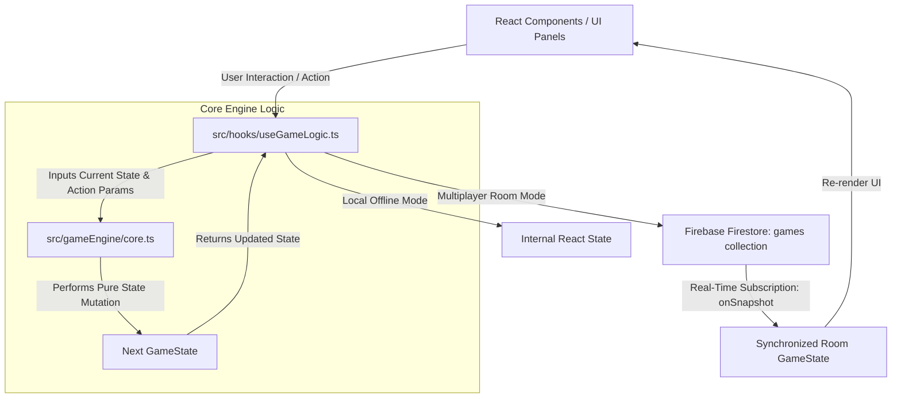

# 🎲 Monopoly Madness Auction - Application Architecture & Developer Manual

Welcome to the **Monopoly Madness Auction** technical architecture documentation. This document serves as a comprehensive system guide, directory map, state flowchart, and developer runbook. 

Whenever you need to introduce new features, tweak existing game mechanics, or debug state transitions, use this document to understand the underlying patterns, constraints, and data flows.

---

## 📌 Architectural Overview

Monopoly Madness Auction is a real-time, multiplayer-first board game built on React, TypeScript, and Tailwind CSS, powered by **Firebase Firestore** for serverless, conflict-free state synchronization. 

The application utilizes a **Unidirectional Data Flow** pattern paired with an **Event-Driven Pure Game Engine**:



### Key Pillars:
1. **Strict Decoupling of Logic and State**: The state is stored either in Firestore (multiplayer) or in a React state hook (local offline play). State transformations are calculated *exclusively* via pure functions defined in the `core.ts` game engine.
2. **Atomic Firestore Transactions**: To prevent race conditions in multiplayer rooms (e.g., two players bidding on the same millisecond or rolling at the same time), all state-mutating actions utilize Firestore `runTransaction`.
3. **Hybrid State Subscription**: The app seamlessly supports local offline gameplay (with bots) and multiplayer rooms. If a `roomId` is present, the hook subscribes to real-time updates via `onSnapshot` and writes updates to the database; otherwise, it degrades gracefully to standard React `useState` updates.

---

## 📂 Codebase Directory & File Mapping

```
monopoly-madness-auction/
├── src/
│   ├── types/
│   │   └── game.ts                # Strict TypeScript models and interface contracts
│   ├── gameEngine/
│   │   └── core.ts                # Pure engine functions (move, purchase, pay rent, bankruptcy)
│   ├── hooks/
│   │   ├── useGameLogic.ts        # Primary state management, Firebase transaction wrappers, deck shufflers
│   │   ├── use-toast.ts           # Toast notification hooks
│   │   └── use-mobile.tsx         # Mobile viewport handler
│   ├── components/
│   │   ├── ui/                    # Reusable shadcn/ui atoms (Dialogs, Buttons, Tabs, Drawers)
│   │   └── game/                  # Game-specific visual and logical components
│   │       ├── MonopolyGame.tsx   # Grand Orchestrator & View Controller
│   │       ├── MonopolyBoardLayout.tsx # SVG/Grid Monopoly Board Layout
│   │       ├── LobbySystem.tsx    # Room creation, joining, and configuration
│   │       ├── TeamPanel.tsx      # Team alliances and shared balances
│   │       ├── TradingSystem.tsx  # Dynamic property and cash trade builder
│   │       ├── AuctionPanel.tsx   # Regular turn bidding module
│   │       ├── PreAuctionPanel.tsx# Draft bidding phase component
│   │       ├── PlayerPanel.tsx    # Portfolio list, house builders, mortgages
│   │       ├── GameConsole.tsx    # Property configuration and customization
│   │       ├── DiceRoller.tsx     # 3D/Visual dice roll triggers
│   │       ├── RentPaymentDialog.tsx # Over-the-board rent collection popups
│   │       ├── GameLog.tsx        # Event feeds and historical logs
│   │       └── TransactionNotification.tsx # Toast overlay of transactions
│   ├── pages/
│   │   ├── Index.tsx              # Mount point for MonopolyGame
│   │   └── NotFound.tsx           # Fallback route
│   ├── lib/
│   │   └── firebase.ts            # Firebase app init & Firestore database instance export
│   ├── App.tsx                    # Routing & global providers
│   ├── main.tsx                   # React DOM render entry
│   └── index.css                  # Global styles, tailwind configs, animations
```

---

## 📊 Domain Data Models (`src/types/game.ts`)

The entire game state is defined by a single unified object contract: `GameState`.

### 1. `Property`
Represents an individual board tile that players can land on, buy, build on, or mortgage:
* `id` (`string`): Unique identifier (e.g., `'prop-1'`).
* `name` (`string`): Indian-themed city name (e.g., `'Mumbai'`, `'Delhi'`).
* `type` (`'property' | 'railroad' | 'utility' | 'special'`): Space category.
* `colorGroup` (`string`): Grouping color (e.g., `'brown'`, `'darkBlue'`).
* `baseValue` & `currentValue` (`number`): Standard market values.
* `rent` (`number[]`): Multi-tier rent array matching house counts `[base, 1 house, 2 houses, 3 houses, 4 houses, hotel]`.
* `houses` (`number`) / `hasHotel` (`boolean`): Building progress.
* `owner` (`string | null`): Name of owning player, if any.
* `position` (`number`): `0-39` position on the board.

### 2. `Player`
An active participant in a lobby:
* `id` (`string`): Player ID (`'player-1'`, `'player-2'`, etc.).
* `name` (`string`): Nickname.
* `balance` (`number`): Current capital.
* `properties` (`string[]`): Owned Property IDs.
* `position` (`number`): Board position index `0-39`.
* `isActive` (`boolean`): Active indicator; set to `false` if bankrupt.
* `isInJail` (`boolean`) & `jailTurns` (`number`): Jailed status.
* `discoveredProperties` (`number[]`): Board tiles this player has landed on or uncovered.

### 3. `Auction`
Represents an active bidding event:
* `propertyId` (`string`): ID of property under auction.
* `startTime` / `duration` / `endTimestamp` (`number`): Dynamic epoch timers.
* `currentBid` (`number`): High bid.
* `highestBidder` (`string | null`): Name of the current leading bidder.
* `bids` (`AuctionBid[]`): Log of bidding increments.
* `isActive` (`boolean`): Status indicator.

### 4. `GameState`
The global state tree synced across all clients in a room:
```typescript
export interface GameState {
  properties: Property[];
  players: Player[];
  teams: Team[];
  currentAuction: Auction | null;
  settings: GameSettings;
  gamePhase: 'setup' | 'draft' | 'auction' | 'playing' | 'ended';
  turn: number;
  currentPlayer: string; // Active Player ID
  lastDiceRoll: DiceRoll | null;
  gameEvents: GameEvent[]; // Rolling history logs (capped to last 20)
  doubleCount: number;
  pendingPurchase: { propertyId: string; playerId: string } | null;
  pendingRent: { propertyId: string; owner: string; amount: number } | null;
  turnState: 'waiting_for_roll' | 'waiting_for_action' | 'processing' | 'completed';
  preAuctionPhase: boolean;
  consoleOpen: boolean;
  tradeOffers: TradeOffer[];
  winnerId?: string | null;
  turnEndTime?: number | null; // Ephemeral epoch countdown
}
```

---

## ⚙️ The Game Engine (`src/gameEngine/core.ts`)

The game engine contains **pure state-transition functions**. They accept a `GameState` and parameters, and return a *new* copy of `GameState` without mutating any parameters in place.

* **`advanceTurn(state)`**:
  Finds the next active, non-spectator player in the circular queue. Updates the `currentPlayer`, resets the `turnState` to `'waiting_for_roll'`, clears ephemeral fields (`pendingPurchase`, `lastDiceRoll`), and appends a `"Turn X - Player Y's Turn"` game event.
  
* **`rollDiceLogic(state, diceResult)`**:
  Processes jail turn reduction if the player is in jail. If they are free, advances the player using `movePlayer`.
  
* **`movePlayer(state, spaces)`**:
  * Updates the current player's board position index (modulo 40).
  * Awards passing GO money if they wrapped around position 0.
  * Adds the tile to their `discoveredProperties` array.
  * Identifies the space type:
    * **Unowned Property/Railroad/Utility**: Sets state to `waiting_for_action` and populates `pendingPurchase`.
    * **Owned Property**: If owned by someone else, calculates the rent using `computeRent` and sets up `pendingRent` with turnState `waiting_for_action`.
    * **Tax Tile**: Immediately applies a 10% cash deduction via `applyPayment` and moves turnState to `completed`.
    * **Jail / Chance / Free Parking**: Triggers appropriate defaults.
    
* **`computeRent(properties, landedProperty, diceTotal)`**:
  * Standard properties: Base rent doubled if the owner holds a monopoly (all properties of that color group) without mortgages. Returns house/hotel tier rent if built.
  * Railroads: Incremental multiplier depending on total owned railroads (`[1: 25k, 2: 50k, 3: 100k, 4: 200k]`).
  * Utilities: Custom dice total scale factor (`4,000 * diceTotal` if 1 owned, `10,000 * diceTotal` if both owned).
  
* **`applyPayment(state, fromId, toPlayerName, amount, reason)`**:
  Adjusts player balances. If the paying player drops below 0:
  * Triggers **Bankruptcy** sequence.
  * Marks the player `isActive = false`.
  * Transfers all assets (properties, hotels) to the creditor (`toPlayerName`). If the creditor is the bank, mortgages are cleared and properties return to the wild.
  * Evaluates `checkWinCondition`.

---

## 🔄 Real-Time Synchronization & Hook Lifecycle (`src/hooks/useGameLogic.ts`)

`useGameLogic` acts as the reactive adapter between the components, the pure engine logic, and the Firestore DB.

```
                  ┌──────────────────────────────┐
                  │      useGameLogic(roomId)    │
                  └──────────────┬───────────────┘
                                 │
                     ┌───────────┴───────────┐
                     ▼                       ▼
            [ ROOM CODE PRESENT ]    [ NO ROOM CODE (LOCAL) ]
                     │                       │
         ┌───────────┴───────────┐           │
         ▼                       ▼           ▼
   Read Snapshot            Transactions    Write directly to
 (onSnapshot listener)    (runTransaction)  useState wrapper
         │                       │           │
         ▼                       ▼           ▼
   Set React State         Update remote DB   Local State Re-render
```

### 1. The React-to-Firestore Adapter Strategy:
```typescript
const [gameStateInternal, setGameStateInternal] = useState<GameState | null>(null);

const setGameState = useCallback((updater: any) => {
  if (!roomId) {
    // Offline Local Execution
    setGameStateInternal(prev => {
      const currentState = prev || getInitialState();
      return typeof updater === 'function' ? updater(currentState) : updater;
    });
    return;
  }
  
  // Real-Time Online Transaction Execution
  const roomRef = doc(db, 'games', roomId);
  runTransaction(db, async (transaction) => {
    const snap = await transaction.get(roomRef);
    const currentState = snap.data().gameState;
    let nextState = typeof updater === 'function' ? updater(currentState) : updater;
    
    transaction.update(roomRef, {
      gameState: nextState,
      lastUpdated: Date.now(),
      playerCount: nextState.players.length
    });
  });
}, [roomId, gameStateInternal]);
```

### 2. Standard Player Turn State Machine Flow:
```
[ waiting_for_roll ] ──( Roll Dice Event )──> [ processing ] (Animate)
                                                   │
                                            ( Land on space )
                                                   │
         ┌─────────────────────────┼───────────────┴────────────────────────┐
         ▼                         ▼                                        ▼
 [ Landed on Owned ]      [ Landed on Tax/Special ]             [ Landed on Unowned ]
         │                         │                                        │
    pendingRent               Calculate Tax                        pendingPurchase Offer
         │                         │                                        │
 ( Rent Dialog Open )       ( Apply Instantly )                      ┌──────┴──────┐
         │                         │                                 ▼             ▼
   [ Pay / Skip ]                  │                             [ Buy Now ]   [ Decline/Auction ]
         │                         │                                 │             │
         ▼                         ▼                                 │      ( Open AuctionPanel )
[ completed ] <────────────────────┴─────────────────────────────────┼─────────────┘
         │                                                           │
   ( 2s Delay )                                                      ▼
         │                                                   Property Acquired
         ▼
    advanceTurn()
```

---

## 🔨 Subsystems

### 1. Bidding & Auction Loop
* **Pre-Auction (Draft Phase)**: Enabled in custom settings, this module forces players to bid on a pool of predetermined properties (`preAuctionProperties`) before regular board movements commence.
* **Turn Auctions**: When a player lands on an unowned property but declines purchasing it, `AuctionPanel` presents a bidding window to all lobby members:
  * Minimum starting bid: **70% of base property value**.
  * Bids extend the auction timer back to a minimum of **15 seconds** if it falls below that limit, ensuring late-stage counters are possible.
  * Winner immediately receives ownership, the balance is deducted, and the game loop advances to the next player's turn.

### 2. Trading Panel
Accessible anytime during a player's turn:
* An interactive multi-asset builder compiles cash offers, requested properties, and offered properties.
* Offers are pushed to the `tradeOffers` array in `GameState` with a status of `'pending'`.
* The receiving player gets a real-time prompt to Accept or Reject, updating balances and ownership instantly.

---

## 🛠️ Step-by-Step Modification Guide

Follow this strict developer workflow when introducing new mechanics or editing existing parameters:

### Step 1: Update the TS Contracts (`src/types/game.ts`)
* If adding a new setting (e.g., *Double Rent on Utilities* or *Custom Bot Difficulty*), append it to the `GameSettings` interface.
* If adding a new space type or event type, ensure the types are registered under the appropriate unions.

### Step 2: Implement Pure Mutations in Engine (`src/gameEngine/core.ts`)
* Create a dedicated helper function for the calculation, or add a branch to an existing engine function (`computeRent`, `movePlayer`, etc.).
* **RULE**: Never modify parameters directly. Always copy sub-nodes using object destructuring (`{ ...state }`) and return clean outputs.

### Step 3: Wire Actions through Adapter Hook (`src/hooks/useGameLogic.ts`)
* Bind your new engine functions within `useGameLogic.ts`.
* Wrap the caller in a `setGameState` callback, ensuring it executes safely in both single-player state updates and multiplayer Firestore transactions.
* **Example of a new action**:
```typescript
const toggleDoubleRentSetting = useCallback((enabled: boolean) => {
  setGameState(prev => ({
    ...prev,
    settings: {
      ...prev.settings,
      doubleRentEnabled: enabled // your new field
    }
  }));
}, [setGameState]);
```

### Step 4: Add Visual Interfaces (`src/components/game/*`)
* Bind actions to interactive controls (buttons, switches, dialogs) inside React components.
* Retrieve state parameters exclusively from the top-level destructuring return of `useGameLogic` in `MonopolyGame.tsx`, and pass them down as read-only props or callback functions.

### Step 5: Test Execution Under Both Modes
* **Local Play**: Leave Room Code empty, add bots, and verify UI reactivity.
* **Multiplayer Play**: Host a lobby, open a separate browser instance to join via Room Code, and verify that both state transitions and transaction intervals execute successfully without conflicts.

---

## 🎨 Customized Branding & Active Property Editor Subsystem

### 1. Customized Brand Assets
* **Custom SVG Icon (`public/favicon.svg`)**: A high-end vector logo designed specifically for *Monopoly Madness*, combining a gold-bordered coin with glowing drop-shadows, a stylized 3D Monopoly top hat with an accent ribbon, dual angled red-piped dice, a mahogany auction gavel, and a red plaque displaying `"MONOPOLY MADNESS"`.
* **Favicon Integration**: Linked as a modern SVG favicon in [index.html](file:///n:/Code/git%20repositories/monopoly-madness-auction/index.html) (`type="image/svg+xml"`) for perfect resolution scaling.
* **In-Game Assets**: Integrated directly as an animated, glowing icon in the headers of [LobbySystem.tsx](file:///n:/Code/git%20repositories/monopoly-madness-auction/src/components/game/LobbySystem.tsx) and [MonopolyGame.tsx](file:///n:/Code/git%20repositories/monopoly-madness-auction/src/components/game/MonopolyGame.tsx).

### 2. Connected Dynamic Property Editor
The Property Editor is now fully wired into the game loop, moving it from a lobby-only configuration step into a live, interactive game moderator console:
* **Active Game Editing**: If `allowPropertyEditing` is active, the lobby host sees a live `"✏️ Edit Properties"` button in the active gameplay header. This mounts and opens the [GameConsole.tsx](file:///n:/Code/git%20repositories/monopoly-madness-auction/src/components/game/GameConsole.tsx) on-the-fly at any turn of the game.
* **Expanded Edit Capabilities**: The host can edit the property's **Name**, **Space Type** (`'property' | 'railroad' | 'utility' | 'special'`), and **Color Group**. This redefines how properties behave with each other, allowing the creation of custom monopolies and custom board space types dynamically.
* **Type-Aware Dynamic Rent Grid**: Rent inputs dynamically adjust based on the edited **Space Type**:
  * *Standard Property*: Customizes all 6 rent levels (`[Base, 1 House, 2 Houses, 3 Houses, 4 Houses, Hotel]`).
  * *Railroad*: Customizes all 4 incremental ownership levels (`[1 Owned, 2 Owned, 3 Owned, 4 Owned]`).
  * *Utility*: Customizes the 2 multipliers (`[1 Utility, 2 Utilities]`).
* **Firestore Real-time Replication**: Save triggers immediately broadcast the modified parameters to the Firestore database. Mapped components (such as board cell labels, property cards, rent dialogs, and engine payment deductions) reactively recalculate based on the updated properties array, ensuring instant game-wide consistency.

---

## 🚦 Developer Checklist for Modifications

Before committing any modifications, run through this quick checklist:

* [ ] **Strict Typing**: No using of `any` types for new state elements. Verify all shapes are described in `src/types/game.ts`.
* [ ] **Side-Effect-Free Engine**: Is `core.ts` completely free of window, canvas, animation, or browser-specific state calls? (All timers and animations belong exclusively in components or React effects).
* [ ] **Local-First Fallback**: Does the feature function correctly when `roomId` is undefined? (Verify that state updaters do not crash when Firestore refs are absent).
* [ ] **Conflict Prevention**: If a state change involves player balances, property transfers, or dice states, is it running inside a transaction wrapper (`runTransaction` inside `setGameState`)?
